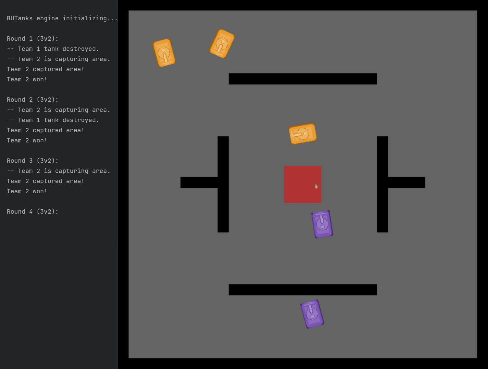

# BUTanks engine

## Table of contents
- [About](#about)
- [Engine](#engine)
- [Examples](#examples)
- [Dependencies](#dependencies)
- [Notable sources](#notable-sources)
- [Notes](#notes)
- [Authors](#authors)
- [License](#license)

## About

Simple game engine for testing various AI algorithms. The game engine is characterized by top-down tank battles of two teams, with easily definable maps, including walls and capture areas. The game itself can be won either by destroying the enemy team or by capturing the defined area (by staying in the area for a specified time).

 

## Engine

The engine is written in form of an easily usable module in [*engine.py*](code/engine/engine.py). The main module also imports another module called [*tanks_utility.py*](code/engine/tanks_utility.py), which includes various utility functions both for the main module and for the examples.

The main features of the game engine are:
- multiple numbers of tanks (two teams),
- maps defined as png images (using alpha channel),
- possibility of turning off rendering,
- automatic output of main events and information to the terminal,
- access to all information about the game and its objects,
- scalable tanks (size),
- manual control option (mainly for testing engine parameters),
- turning off/on the rendering of the tank's center-to-wall distance sensors,
- robust wall collisions.

The user is free to implement a wide variety of algorithms to win the match. The example starting configuration is in [*main_example.py*](code/engine/main_example.py).

## Examples

A few non-ideal examples of AI testing are also provided for exploration:_main_astar.py_ for an influence map combined with A* pathfinding,
*  [*gym_DQN.py*](code/engine/gym_DQN.py) for implementation of the engine into the OpenAI gym environment and attempt for DQN,
*  [*main_ActorCritic_duel.py*](code/engine/main_ActorCritic_duel.py) for actor-critic reinforcement learning.

## Dependencies

The project was created with Python 3.9.1 and relies on the following dependencies (all listed in PyPi):
- core dependencies:
  - PyGame 2.0.1
  - Numpy 1.19.5
- additionall dependencies:
  - Pyastar2D (fast A* algortihm)
  - Gym (OpenAI gym)
  - Tesorflow

## Notable sources

- Deep Q Learning: https://keras.io/examples/rl/deep_q_network_breakout/

- Introduction to Actor-Critic method: https://www.learn-drl.com/tutorials/rl/actorcritic/actorcritic.html

- Actor-Critic for actions on continuous intervals: https://kae1506.medium.com/actor-critic-methods-with-continous-action-spaces-having-too-many-things-to-do-e4ff69cd537d

## Notes

- When turning off rendering to train faster, make sure to set fixed DT. Otherwise, the game's FPS will be capped (the default is 60).
- Mutual collisions of tanks are not solved ideally, avoid this state to prevent problems.

## Authors

[@VojtechMlynar](https://github.com/VojtechMlynar) and
[@Kophejn](https://github.com/Kophejn)

## License

Licensed under the [MIT License](LICENSE).
